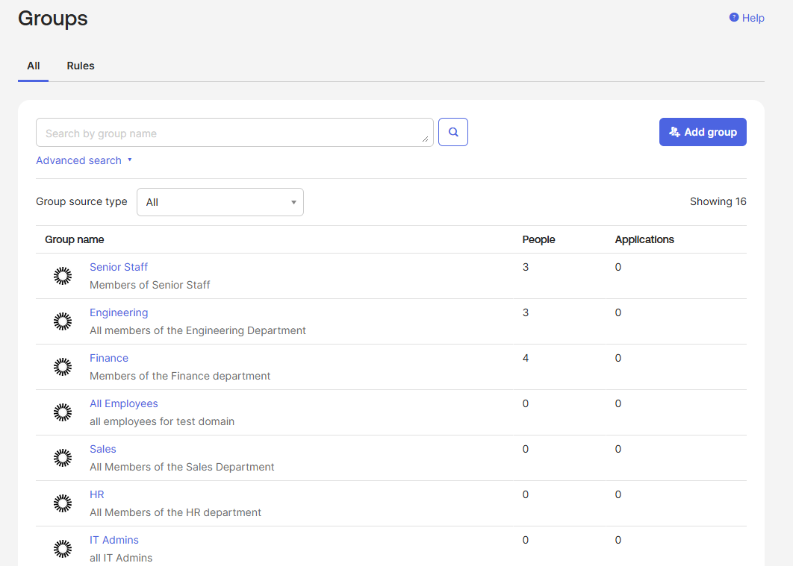
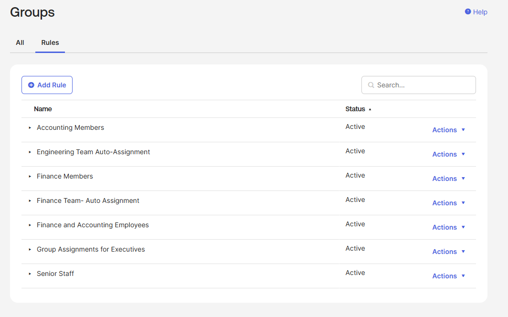
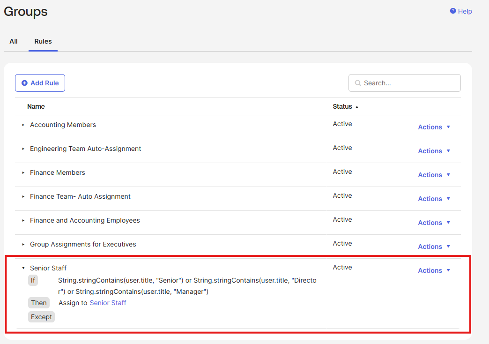

# Project 1: Attribute-Based Access Control

Foundational identity governance using Okta's Universal Directory, dynamic 
groups, and Expression Language to drive automated, attribute-driven access 
decisions.

## Problem Statement

Most access problems don't start as access problems — they start as HR data 
problems. When an employee's department or title is wrong in the system of 
record, every downstream access decision inherits that error. Multiplied 
across hundreds of employees, with turnover and internal moves, this is the 
access sprawl behind most audit findings: over-permissioned users, orphaned 
accounts, and group memberships no one can explain.

This project establishes the foundational layer for solving that at scale: 
attribute-driven group assignment that ties access directly to authoritative 
identity data.

## What I Built

A working Okta org with:

- 8 test users with realistic department and title attributes
- Static groups for fixed organizational structure (All Employees, IT Admins)
- Dynamic groups driven by user attributes (Engineering, Finance)
- A compound rule for Senior Staff using Expression Language string matching 
  across multiple title patterns

## Configuration Details

### Group Rules

**Engineering Team Auto-Assignment**
user.department == "Engineering"

**Finance Team Auto-Assignment**
user.department == "Finance"

**Senior Staff (compound rule across departments)**
String.stringContains(user.title, "Senior") or
String.stringContains(user.title, "Director") or
String.stringContains(user.title, "Manager")

The Senior Staff rule demonstrates Okta Expression Language beyond simple 
equality checks. Seniority is a cross-departmental concept, so the rule 
correctly assigns a Senior Engineer, a Finance Manager, and a Sales Director 
to the same access tier — three departments, one rule.

## Screenshots

### Group structure

### Group rules in priority order

### Senior Staff membership (rule evaluation result)

## Business Value

**Security teams** care because automated group assignment closes the gap 
between a title change in HR and a permission change in the application. 
That gap is where insider threat and audit findings live.

**IT operations teams** care because every group rule is a ticket that 
doesn't get filed. Joiner-mover-leaver workflows stop depending on someone 
remembering to update access manually.

**Compliance teams** care because attribute-driven access is defensible 
access. The rule, the attribute, and the evaluation log together provide a 
clear audit trail explaining exactly why a user has the access they have.

## Exam Domain Mapping

**Okta Certified Professional**
- Onboarding: Create users, Create groups, Assign users to groups, Create 
  group rules
- Universal Directory: Profile attributes used as group rule conditions

## Lessons Learned

- Expression Language uses lowercase `or` and `and`, not the uppercase forms 
  used in many other query languages
- `String.stringContains` is case-sensitive, which matters for title 
  matching ("Manager" matches "Sales Manager" but not "sales manager")
- Group rule evaluation is asynchronous — expect a 1–2 minute delay between 
  rule activation and group membership updates
- A naive "Manager" contains-check would catch "Assistant Manager" — worth 
  considering whether that's intended behavior or a bug in your access model