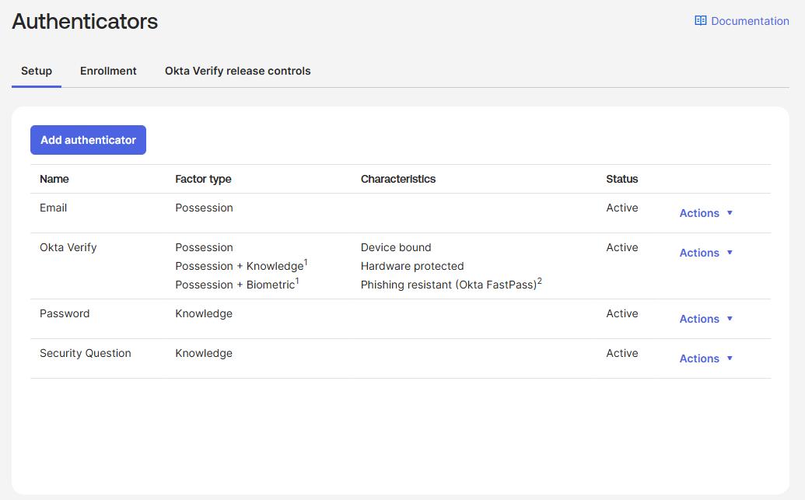
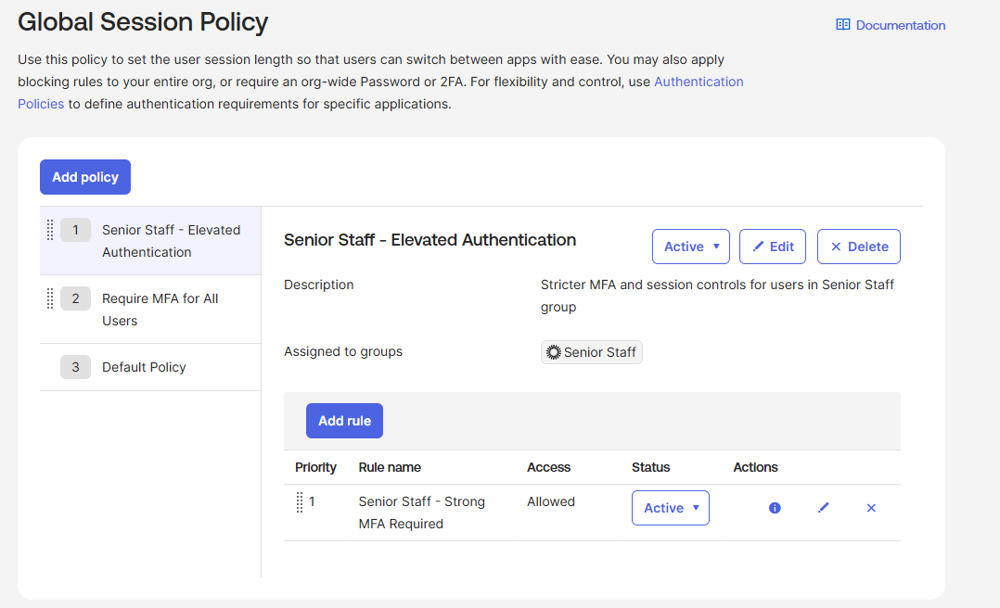
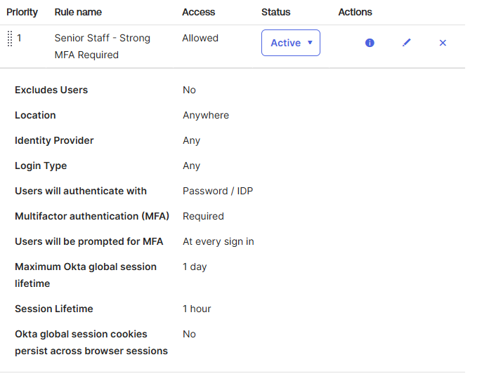

# Project 2: Sign-On Policies and MFA Enforcement

Defense-in-depth authentication using Okta's Global Session Policy 
framework, layered authenticator configuration, and group-scoped policy 
prioritization to enforce risk-tiered access controls.

## Problem Statement

Multi-factor authentication is the single highest-impact control most 
organizations can deploy, but blanket MFA policies treat every user the 
same regardless of access scope. A help desk technician and a senior 
director both authenticate into systems containing sensitive data, but 
their blast radius if compromised is dramatically different.

The right answer isn't "MFA for everyone" — it's MFA *plus* tighter 
session controls, stricter prompt frequency, and stronger authenticators 
for users whose accounts carry elevated risk. Building that requires 
policy layering: a baseline that catches everyone, with stricter overlays 
on higher-privilege groups.

This project establishes that risk-tiered authentication framework in Okta.

## What I Built

A Global Session Policy stack with three layers, evaluated in priority 
order:

- **Senior Staff — Elevated Authentication** (Priority 1) — stricter 
  session controls and shorter timeouts for users in the Senior Staff 
  group from Project 1
- **Require MFA for All Users** (Priority 2) — baseline MFA enforcement 
  for the entire user population
- **Default Policy** (Priority 3) — Okta's built-in safety net policy

Plus configuration of org-level authenticators (Email, Okta Verify, 
Password, Security Question) on the Setup tab to ensure required factors 
are available for the policies above to enforce.

## Configuration Details

### Authenticator Configuration

| Authenticator | Factor Type | Status |
|---|---|---|
| Email | Possession | Active |
| Okta Verify | Possession + Knowledge + Biometric | Active |
| Password | Knowledge | Active |
| Security Question | Knowledge | Active |

Phone (SMS/voice) authenticator is unavailable in dev tenants and was not 
configured. Okta Verify with FastPass provides phishing-resistant 
authentication aligned with NIST AAL3 requirements.

### Senior Staff Policy — Rule Configuration

| Setting | Value |
|---|---|
| Location | Anywhere |
| Identity Provider | Any |
| Login Type | Any |
| Authentication factor | Password / IDP |
| Multifactor Authentication | Required |
| MFA prompt frequency | At every sign-in |
| Maximum global session lifetime | 1 day |
| Session lifetime (inactivity) | 1 hour |
| Session cookies persist across browser sessions | No |

The combination of every-sign-in MFA prompts, 1-hour inactivity timeout, 
and non-persistent session cookies forces a fresh authentication anytime 
a Senior Staff user resumes work — a control set appropriate for users 
with elevated access scope.

### Baseline Policy — Differentiation

The baseline "Require MFA for All Users" policy uses similar settings 
with a longer 2-hour session lifetime and the same every-sign-in MFA 
requirement, balancing security with user experience for the broader 
employee population.

## Screenshots

### Authenticators configured at the org level

### Global Session Policy stack with priority ordering

### Senior Staff policy rule detail

## Business Value

**Security teams** care because risk-tiered authentication is the 
operational implementation of least-privilege thinking applied to the 
authentication layer. A blanket MFA policy is a checkbox; a tiered policy 
framework is a defensible security architecture.

**IT operations teams** care because policy layering scales without 
proportional administrative overhead. Adding a new high-privilege group 
in the future means assigning the existing Senior Staff policy to it, 
not building a new policy from scratch.

**Compliance teams** care because policy priority and group scoping 
produce clean audit evidence. The System Log captures every policy 
evaluation event with the matched policy name, supporting requirements 
under HIPAA Security Rule access control standards (45 CFR § 164.312) 
and NIST SP 800-53 IA-2 (Identification and Authentication).

## Exam Domain Mapping

**Okta Certified Professional**
- Security Enforcement: MFA factor configuration, Set up MFA enrollment 
  for users in a group, Create a sign-on policy
- Application Setup: Sign-on policy assignment to groups (foundational; 
  application-level sign-on policies covered in later projects)

## Lessons Learned

- Okta's "Global Session Policy" was previously called "Okta Sign-On 
  Policy" and is distinct from "Authentication Policy" (which governs 
  per-application sign-on) — the naming evolved across Okta Identity 
  Engine versions and the distinction matters for both exam questions 
  and real configuration work
- Policy priority order matters absolutely: a Senior Staff policy below 
  the global "all users" policy in the priority list will never evaluate 
  for Senior Staff users because the global policy catches them first
- The default policy at the bottom of the stack is the safety net — 
  modifying it directly is risky; adding policies above it is the 
  conservative pattern
- Admin console authentication is governed by a separate "Admin App 
  Policy," not the Global Session Policy — admin sign-in events in the 
  System Log will reference Admin App Policy, which is by design and a 
  security best practice (admin access is governed independently)