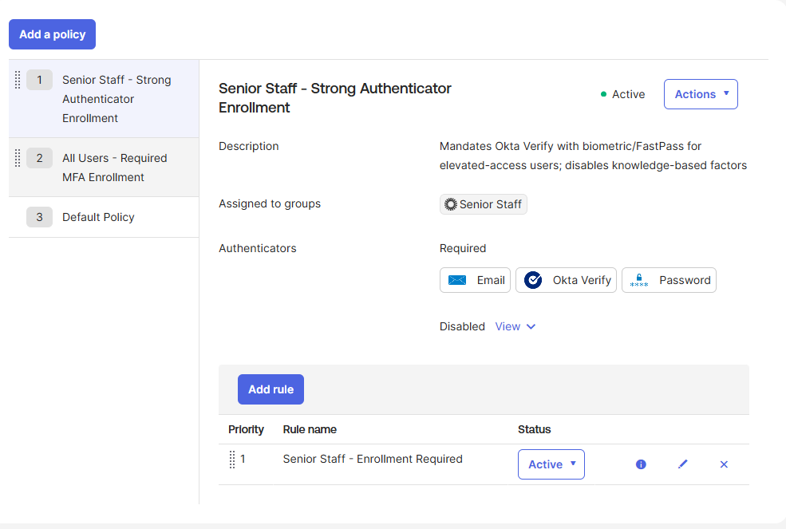
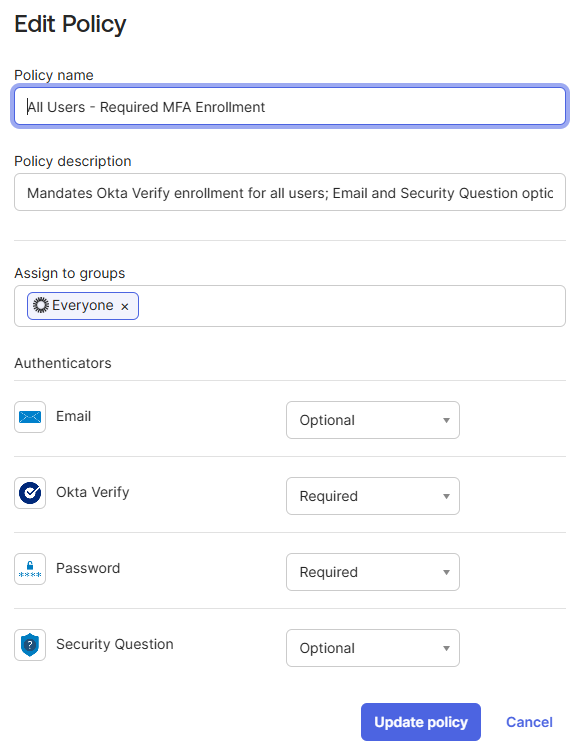

# Project 3: MFA Enrollment Policies

Authenticator enrollment governance using Okta's Authenticator Enrollment 
Policy framework to control which factors users must register, when they 
register them, and how requirements differ by group risk tier.

## Problem Statement

A sign-on policy that requires MFA is only as effective as users' ability 
to satisfy it. If a user must authenticate with a second factor at sign-in 
but has never been required to enroll one, they encounter the gate but 
can't pass through it — and the friction lands on the help desk, not the 
attacker.

Enrollment policies close that loop. They control which authenticators 
users must register before they can authenticate, which factors are 
optional for recovery flows, and which are disabled entirely because they 
don't meet the security bar for a given user population.

This project pairs with Project 2's sign-on policies to form a complete 
MFA story: Project 2 enforces the gate, Project 3 ensures users can pass 
through it on their employer's terms.

## What I Built

A two-policy enrollment stack with risk-tiered authenticator requirements:

- **Senior Staff — Strong Authenticator Enrollment** (Priority 1) — 
  requires Email, Okta Verify, and Password; explicitly disables Security 
  Question to eliminate knowledge-based factors for elevated-access users
- **All Users — Required MFA Enrollment** (Priority 2) — requires Okta 
  Verify and Password; treats Email and Security Question as optional 
  recovery factors

Each policy is paired with an active rule that scopes when enrollment 
applies and which authenticators are permitted under the policy.

## Configuration Details

### Senior Staff Policy

| Authenticator | Enrollment |
|---|---|
| Password | Required |
| Okta Verify | Required |
| Email | Required |
| Security Question | Disabled |

Email becomes Required (not Optional) at this tier to guarantee a 
recovery channel for privileged accounts. Security Question is Disabled 
because knowledge-based factors are the easiest authenticator class to 
defeat — through social engineering, OSINT, and breach data lookups — 
and have no place in the authenticator stack for elevated-access users.

### All Users Policy

| Authenticator | Enrollment |
|---|---|
| Password | Required |
| Okta Verify | Required |
| Email | Optional |
| Security Question | Optional |

Okta Verify enrollment is mandatory across the entire user population 
because it provides phishing-resistant authentication via FastPass, which 
aligns with NIST AAL2/AAL3 requirements. Email and Security Question 
remain available as optional recovery factors.

### Rule Configuration

Both policies use a single active rule with the same baseline conditions:

| Setting | Value |
|---|---|
| User type | Any user type |
| User's IP | Anywhere |
| Authentication source | Any device platform |
| Enrollment | Allowed for all authenticators |

The rule is the activation layer — it determines when the policy 
evaluates. The policy-level authenticator settings determine *what* the 
policy enforces when it does evaluate. A policy without a rule is inert; 
a rule without a policy has nothing to apply.

## Screenshots

### Enrollment policy stack with priority ordering

### Senior Staff policy detail with rule

### All Users policy detail with rule

## Business Value

**Security teams** care because enrollment policies are the difference 
between MFA as a checkbox and MFA as a defensible control. A sign-on 
policy that requires MFA without a corresponding enrollment policy 
creates a population of users who *should* be using MFA but aren't, 
because nothing forced them to enroll. The audit finding writes itself.

**IT operations teams** care because risk-tiered enrollment reduces help 
desk volume in two directions. Mandatory Okta Verify enrollment at first 
sign-in eliminates the "I keep getting prompted but never set anything up" 
ticket class. Disabling weak factors for privileged users eliminates the 
account compromise tickets that follow successful social engineering 
attacks against Security Question answers.

**Compliance teams** care because authenticator selection is increasingly 
regulated. NIST SP 800-63B classifies knowledge-based factors as low 
strength and explicitly recommends against them for elevated-assurance 
applications. Healthcare regulators (HIPAA Security Rule, 45 CFR § 
164.312(d)) require person-or-entity authentication appropriate to the 
sensitivity of the data being accessed, and risk-tiered enrollment is 
how that proportionality gets implemented in practice.

## Exam Domain Mapping

**Okta Certified Professional**
- Security Enforcement: MFA factor configuration, Set up MFA enrollment 
  for users in a group, Enrollment policy configuration
- Universal Directory: Group-based policy targeting (foundational; 
  builds on Project 1's group structure)

## Lessons Learned

- A policy without a rule does not apply to users — Okta surfaces this 
  with a warning banner, but it's a structural concept worth 
  internalizing: the policy holds the authenticator settings, the rule 
  is the activation layer that says "apply this policy under these 
  conditions"
- Rule-level "Enrollment is: Allowed for all authenticators" and 
  policy-level "Required / Optional / Disabled" are two different 
  controls operating at two different layers — the rule decides whether 
  enrollment can happen at all, the policy decides which authenticators 
  must be enrolled when it does
- Policy priority order matters here just as it did in Project 2: the 
  Senior Staff policy must be above the All Users policy so members of 
  Senior Staff hit the stricter policy first
- Existing users aren't reprompted to enroll when an enrollment policy 
  is updated — enrollment policies apply at next sign-in, not 
  retroactively, which has implications for rollout planning in real 
  environments
- Password enrollment cannot be set to Optional or Disabled at any 
  policy tier — this is a platform constraint, not a configuration 
  choice, reflecting that password is the floor of the authenticator 
  stack