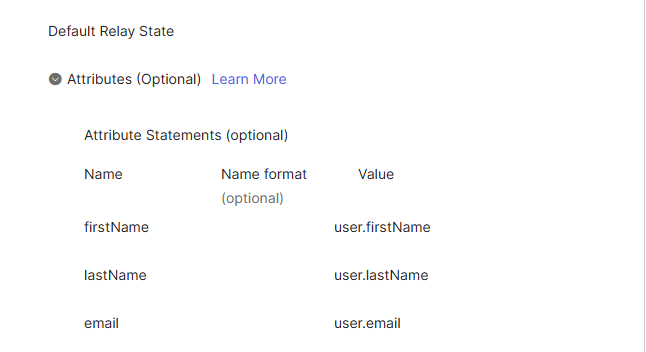
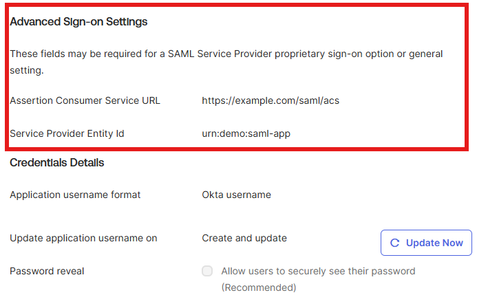
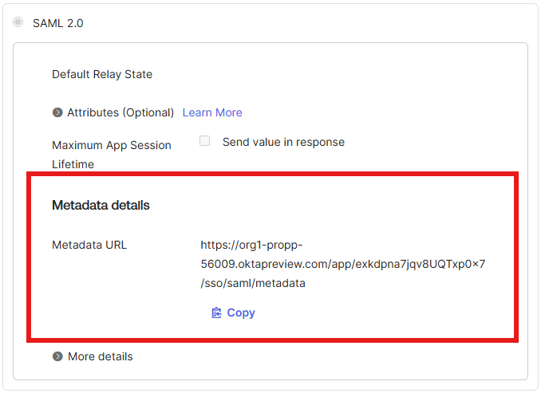
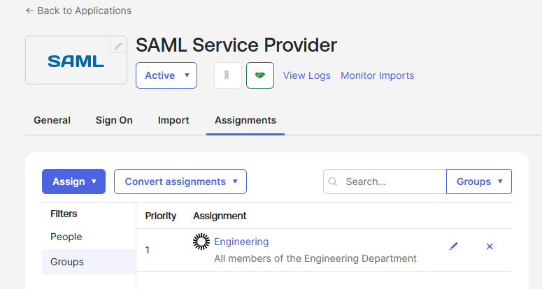
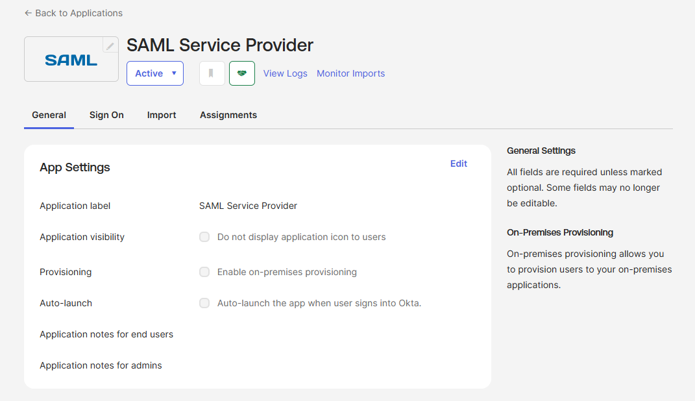

# Project 5: SAML Application from the Okta Integration Network

Application integration using a generic SAML 2.0 template from the Okta
Integration Network (OIN), demonstrating end-to-end SAML federation
configuration including assertion enrichment with user attributes and
group-based access assignment.

## Problem Statement

A modern enterprise relies on dozens to hundreds of SaaS applications.
Configuring federated authentication for each one — from scratch, per
the SAML 2.0 specification — would be hundreds of hours of XML wrangling,
certificate management, and protocol debugging. The Okta Integration
Network (OIN) eliminates this work by providing 10,000+ pre-built
application integrations with vendor-tested SAML, OIDC, SWA, and SCIM
configurations.

This project demonstrates the OIN integration workflow using the generic
SAML Service Provider template, configuring the SAML protocol settings,
enriching the assertion with user attributes, and connecting the
integration to existing identity structure through group-based assignment.

## What I Built

A working SAML 2.0 application integration in Okta with:

- A generic SAML Service Provider integration added from the OIN
- Configured SAML 2.0 settings including ACS URL, SP Entity ID, and
  application username format
- Three attribute statements (firstName, lastName, email) that enrich
  the SAML assertion sent to the SP at sign-in
- Group-based assignment scoping access to the Engineering group from
  Project 1
- Auto-generated IdP federation metadata available for consumption by
  a receiving service provider

## Configuration Details

### SAML Protocol Settings

| Setting | Value |
|---|---|
| Sign-on method | SAML 2.0 |
| Assertion Consumer Service (ACS) URL | https://example.com/saml/acs |
| Service Provider Entity Id | urn:demo:saml-app |
| Application username format | Okta username |
| Update application username on | Create and update |

### Attribute Statements

The SAML assertion is enriched with three user attributes drawn from
Okta Universal Directory:

| Attribute Name | Name format | Source |
|---|---|---|
| firstName | Basic | user.firstName |
| lastName | Basic | user.lastName |
| email | Basic | user.email |

These attributes are included in the SAML XML assertion at every
sign-in event, allowing the receiving SP to make access and
personalization decisions based on identity data sourced from Okta.

### Federation Metadata

Okta automatically generates IdP federation metadata at a tenant-specific
URL. This metadata contains the IdP single sign-on URL, issuer identifier,
and X.509 signing certificate — the three pieces of data a receiving SP
needs to complete the trust relationship.

In a production integration, this metadata URL is provided to the SaaS
application's SSO configuration, completing the federation handshake.

## Screenshots

### SAML attribute statements

### Advanced Sign-on Settings (ACS URL and Entity ID)

### IdP federation metadata

### Group-based application assignment

### Application overview

## Business Value

**Security teams** care because federated SSO eliminates application-
specific password attack surfaces. Without SAML, every SaaS app
maintains its own password store, becoming a target for credential
stuffing, phishing, and account takeover. Federation centralizes
authentication at the IdP, where MFA, conditional access, and
behavioral analytics can be enforced uniformly across the application
portfolio.

**IT operations teams** care because the OIN compresses what would
otherwise be days of integration work per app into minutes. Pre-built
integrations include vendor-tested SAML configurations, attribute
mappings, and provisioning workflows — eliminating most of the trial-
and-error that custom SAML configurations require. Group-based
assignment means new hires get appropriate app access automatically
through the same group rules that drive the rest of identity
governance.

**Compliance teams** care because federated authentication produces
auditable, centralized access evidence. Every SAML sign-in is logged
in Okta's System Log with the user, application, timestamp, and
authentication method. This satisfies the access logging requirements
under HIPAA Security Rule (45 CFR § 164.312(b)) and similar audit
controls under SOC 2, ISO 27001, and NIST SP 800-53 (AU-2).

## Exam Domain Mapping

**Okta Certified Professional**
- Application Setup with OIN: Add a SAML 2.0 app integration, Configure
  the application's SAML settings (ACS URL, Entity ID, attribute
  statements), Assign the application to a group
- Identity and Access Management: SAML 2.0 federation protocol, IdP-
  initiated and SP-initiated flow patterns
- Universal Directory: User attributes referenced in SAML assertion
  via Okta Expression Language

## Lessons Learned

- The OIN catalog includes both vendor-specific SAML integrations
  (Salesforce SAML, Workday SAML, etc.) and generic SAML templates
  (SAML Service Provider, SAML 2.0 IdP). The generic templates are
  the right choice for custom or in-house applications without
  pre-built OIN integrations.
- "SAML 2.0 IdP" and "SAML Service Provider" sound similar but serve
  opposite federation directions. SAML 2.0 IdP is for inbound
  federation (when an external IdP federates INTO Okta as the SP).
  SAML Service Provider is for outbound federation (Okta as IdP,
  external app as SP). Project 5 needs the latter.
- Attribute Statements and Profile Mappings are two distinct
  mechanisms that are easy to confuse. Attribute Statements are
  per-app SAML assertion enrichment configured at sign-on. Profile
  Mappings are bidirectional attribute synchronization between Okta
  UD and the app's user store, used primarily for provisioning. The
  exam tests this distinction.
- The auto-generated Metadata URL is the IdP-side equivalent of "here
  is everything a receiving SP needs to trust me." Real SaaS
  integrations typically import this URL on the SP side to bootstrap
  the federation rather than manually copying issuer URI, signing
  certificate, and SSO endpoint individually.
- The Application username format setting determines what value is
  sent as the SAML NameID. Choosing "Okta username" sends the user's
  Okta sign-in name; "Email" sends the email attribute. The choice
  matters because the receiving SP uses NameID to identify the user,
  and a mismatch between Okta's username format and the SP's expected
  format breaks the integration even when everything else is correct.